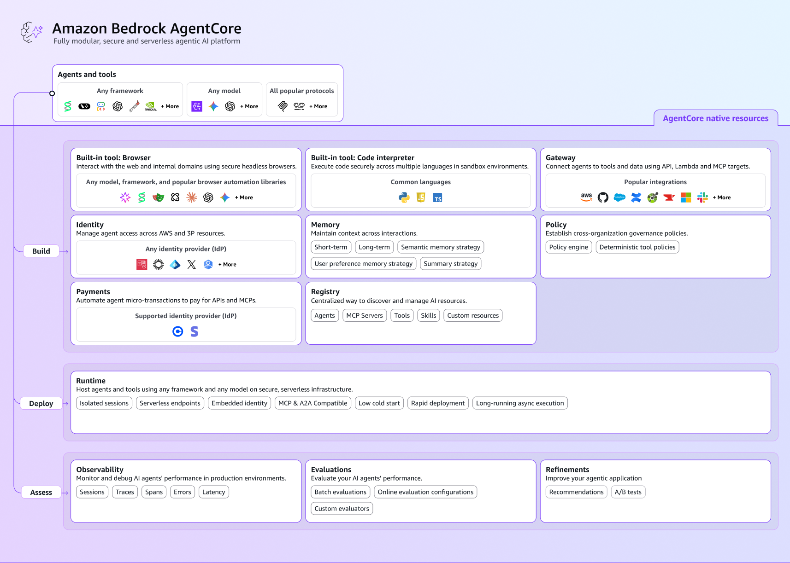

# Building your first AI agent and deploying it in the cloud

We've been using Strands to build AI agents and add tools to them so here we're going a step further.
This is a hands-on tutorial that we'll follow to build, deploy, and integrate an AI travel assistant using Strands Agents and Amazon Bedrock AgentCore.

**Duration:** 2-3 hours  
**Difficulty:** Beginner to Intermediate  
**What you'll build:** Wanderly (or any name of your choice), an AI travel assistant that runs in the cloud

---

## Table of Contents

1. [Prerequisites & AWS Account Setup](#1-prerequisites--aws-account-setup)
2. [Phase 1: Your First Agent](#2-phase-1-your-first-agent)
3. [Phase 2: Adding Tools](#3-phase-2-adding-tools)
4. [Phase 3: Preparing for Cloud Deployment](#4-phase-3-preparing-for-cloud-deployment)
5. [Phase 4: Deploying to AWS](#5-phase-4-deploying-to-aws)
6. [Phase 5: Testing in AWS Console](#6-phase-5-testing-in-aws-console)
7. [Phase 6: Building a Full-Stack Application](#7-phase-6-building-a-full-stack-application)
8. [Phase 7: Deploying to GitHub & AWS Amplify](#8-phase-7-deploying-to-github--aws-amplify)
9. [Cleanup & Cost Management](#9-cleanup--cost-management)

---

## 1. AWS billing, prerequisites, and AWS account setup

### What to know about AWS billing

Most of us hesitate to create an AWS account because we fear the unexpected bill.

For **new AWS accounts**; when you create a new AWS account [you get $100-200 in free AWS credits](https://aws.amazon.com/free/) that CAN be used for Amazon Bedrock. This means you can likely complete this entire tutorial **for free** using AWS credits.

#### <u>How much will this tutorial cost you</u>

Without AWS credits, using the Amazon Nova Pro model in Amazon Bedrock, this tutorial will cost as follows:

- **Amazon Bedrock (Amazon Nova Pro):** ~$0.0008 per 1,000 input tokens, ~$0.0032 per 1,000 output tokens.
- **For this entire tutorial:** Expect to spend **$1-5 USD maximum** if you follow along and clean up afterwards.
- **AgentCore Runtime:** Pay only for what you use (per-second billing).

#### <u>How to protect yourself from surprise bills</u>

1. **Start with a budget cap** of $10-20 for learning
2. **Set up a billing alarm** (we'll do this below)
3. **Use your free AWS credits** new accounts get $100-200
4. **Clean up resources** when you're done (we'll remind you)

### Prerequisites (What you'll need)

- **Python 3.10 or higher** installed on your computer
- **A code editor** (VS Code recommended)
- **An AWS account** (we'll help you set this up safely)

#### <u>Install Python Packages</u>

These are the libraries we'll use throughout the tutorial. You can run this now while your AWS account is being set up in later steps.

```bash
pip install strands-agents bedrock-agentcore bedrock-agentcore-starter-toolkit boto3 flask
```

> **Don't have Python?** Install Python 3.10 or higher from [python.org](https://www.python.org/downloads/) before running the command above.

### Create your AWS account

1. Go to [aws.amazon.com](https://aws.amazon.com)
2. Click **"Create an AWS Account"**
3. Follow the signup process (you'll need a credit card, but won't be charged yet)
4. Choose the **"Basic Support - Free"** plan

#### <u>Set up a billing alarm (important!)</u>

Setting up a billing alarm protects you from unexpected charges:

1. Sign in to the [AWS Console](https://console.aws.amazon.com)
2. Search for **"Billing"** in the top search bar
3. Click **"Billing and Cost Management"**
4. In the left menu, click **"Budgets"**
5. Click **"Create budget"**
6. Under **"Templates - New"**, choose **"Monthly cost budget"**
7. Set your budget amount to **$10** (or whatever you're comfortable with)
8. Add your email address for alerts
9. Click **"Create budget"**

Now you'll get an email if your spending approaches your limit.

#### <u>Enable Amazon Bedrock Model Access</u>

Before you can use AI models, you need to enable access. Most Bedrock models grant access instantly with a single click — no forms, no waiting. We're using **Amazon Nova Pro** for this workshop because it's first-party AWS (owned by AWS), supports tool use well, and is granted instantly.

> **Note:** Anthropic's Claude models on Bedrock require submitting a use-case form on first use. We're skipping that path so the workshop runs smoothly. The code we write is model-agnostic — you can swap to Claude later once you have access.

1. In the AWS Console, search for **"Amazon Bedrock"** and click on it
2. Make sure your region is set to **us-east-1** (top-right of the console)
3. In the left sidebar, expand **"Test"** and click **"Chat / Text playground"** (or just **"Playground"**)
4. Click **"Select model"**
5. Choose **Amazon** as the provider, then select **Nova Pro**
6. Access is granted immediately — no form to fill out

**Tip:** Try a quick test prompt in the playground (e.g., "Hello!") to confirm the model is working before moving on.

#### <u>Create an IAM User for development</u>

For security, avoid using your root account for development:

1. Search for **"IAM"** in the AWS Console
2. Click **"Users"** in the left sidebar
3. Click **"Create user"**
4. Name it something like `dev-user`
5. Click **"Next"**
6. Select **"Attach policies directly"**
7. Search and attach these policies:
   - `AmazonBedrockFullAccess`
   - `AmazonEC2ContainerRegistryFullAccess`
   - `AWSCodeBuildAdminAccess`
   - `AmazonS3FullAccess`
   - `IAMFullAccess`
8. Click **"Next"**, then **"Create user"**
9. Click on your new user, go to **"Security credentials"**
10. Click **"Create access key"**
11. Choose **"Command Line Interface (CLI)"**
12. **Save your Access Key ID and Secret Access Key** somewhere safe!

#### <u>Configure AWS Credentials (Notepad)</u>

Your code needs to know your AWS credentials. boto3 (used by Strands Agents and the AgentCore toolkit) reads them from two plain-text files in your home folder. We'll update them in Notepad.

1. Open **File Explorer** and navigate to your user folder:
   ```
   C:\Users\YOUR_USERNAME
   ```
2. Create a new folder called `.aws` (note the leading dot)
   - Tip: in File Explorer, right-click → New → Folder → name it `.aws.` (Windows will trim the trailing dot for you)
3. Open **Notepad** and paste the following, replacing the placeholders with your access key and secret key from Step 1.5:

   ```ini
   [default]
   aws_access_key_id = YOUR_ACCESS_KEY_ID
   aws_secret_access_key = YOUR_SECRET_ACCESS_KEY
   ```

4. Save the file as `credentials` (no file extension) inside the `.aws` folder:
   - In Notepad's Save dialog, change **"Save as type"** to **"All Files (*.*)"**
   - Filename: `credentials`
   - Save it in `C:\Users\YOUR_USERNAME\.aws\`

5. Open a fresh Notepad window and paste:

   ```ini
   [default]
   region = us-east-1
   output = json
   ```

6. Save this one as `config` (also no extension) in the same `.aws` folder.

Your folder should now contain two files:
```
C:\Users\YOUR_USERNAME\.aws\credentials
C:\Users\YOUR_USERNAME\.aws\config
```

That's it — boto3 will pick these up automatically.

> **Mac/Linux users:** Create the same two files at `~/.aws/credentials` and `~/.aws/config` using any text editor.

You're now ready to build your first agent!

---

## 2. Phase 1: Your First Agent

Let's start with the simplest possible AI agent. Create a new folder for your project and a file called `simple_agent.py`.

### Step 2.1: Create the Project Folder

```bash
mkdir wanderly-travel-agent
cd wanderly-travel-agent
```

### Step 2.2: Create simple_agent.py

Create a new file called `simple_agent.py` and add this code:

```python
# ============================================================
# Phase 1: The Simplest Possible Agent
# ============================================================

from strands import Agent
from strands.models import BedrockModel

# Model selection is flexible - swap this out for any supported provider:
#   model = OpenAIModel(model_id="gpt-4o")           # OpenAI  
#   model = AnthropicModel(model_id="claude-sonnet-4-6")  # Anthropic Direct
#   model = OllamaModel(model_id="llama3")           # Local/Free

model = BedrockModel(model_id="us.amazon.nova-pro-v1:0")

agent = Agent(
    model=model,
    system_prompt="""You are Wanderly, a friendly travel assistant. Help users plan trips, 
find local gems, and navigate destinations. Be practical, culturally aware, and concise. 
Never make bookings or guarantee prices—recommend verifying with official sources."""
)

response = agent("First time in Cape Town, here until next Monday. What do locals recommend that tourists usually miss?")
print(response)
```

### Step 2.3: Run Your First Agent

```bash
python simple_agent.py
```

**What did we do here**

1. We imported the `Agent` class from Strands Agents
2. We created a `BedrockModel` pointing to Amazon Nova Pro on Amazon Bedrock
3. We created an agent with a personality (the system prompt)
4. We asked it a question and printed the response

That's it! You've built an AI agent in about 15 lines of code.

### Understanding the Code

| Component | What it does |
|-----------|--------------|
| `BedrockModel` | Connects to Amazon Bedrock to use a foundation model |
| `model_id="us.amazon.nova-pro-v1:0"` | Specifies which AI model to use |
| `system_prompt` | Defines the agent's personality and rules |
| `agent("...")` | Sends a message to the agent and gets a response |

---

## 3. Phase 2: Adding Tools

A chatbot that only talks is limited. [Let's give our agent **tools**](https://strandsagents.com/docs/user-guide/concepts/tools/) which are functions it can call to get real information.

### Step 3.1: Create agent_with_tools.py

Define any Python function as a tool by using the [@tool decorator](https://strandsagents.com/docs/api/python/strands.tools.decorator/#tool). Function decorated tools can be placed anywhere in your codebase and imported in to your agent’s list of tools. 
So, create a new file called `agent_with_tools.py`:

```python
# ============================================================
# Phase 2: Agent with Tools
# ============================================================

from strands import Agent, tool
from strands.models import BedrockModel

# ============================================================
# TOOLS: Functions the agent can call autonomously
# ============================================================

@tool
def get_weather(city: str) -> str:
    """Get the current weather for a city."""
    # In production, this would call a real weather API
    weather_data = {
        "Johannesburg": "Sunny, 22°C",
        "Cape Town": "Windy, 18°C", 
        "Durban": "Warm and humid, 26°C",
        "Pretoria": "Clear skies, 24°C",
        "Soweto": "Sunny, 21°C",
    }
    return weather_data.get(city, f"Weather data not available for {city}")

@tool
def search_attractions(city: str, category: str = "all") -> str:
    """Search for tourist attractions in a city by category."""
    attractions = {
        "Johannesburg": {
            "wildlife": ["Lion Park", "Johannesburg Zoo", "Rhino & Lion Nature Reserve"],
            "culture": ["Apartheid Museum", "Constitution Hill", "Maboneng Precinct"],
            "food": ["Marble Restaurant", "The Grillhouse", "Urbanologi"],
        },
        "Cape Town": {
            "wildlife": ["Table Mountain", "Boulders Beach Penguins", "Kirstenbosch Gardens"],
            "culture": ["Robben Island", "District Six Museum", "V&A Waterfront"],
            "food": ["The Test Kitchen", "La Colombe", "Kloof Street House"],
        }
    }
    city_data = attractions.get(city, {})
    if category == "all":
        return str(city_data)
    return str(city_data.get(category, f"No {category} attractions found"))

@tool  
def estimate_budget(city: str, days: int, style: str = "mid-range") -> str:
    """Estimate daily travel budget for a city."""
    budgets = {
        "Johannesburg": {"budget": 40, "mid-range": 100, "luxury": 250},
        "Cape Town": {"budget": 50, "mid-range": 120, "luxury": 300},
    }
    city_budget = budgets.get(city, {"budget": 45, "mid-range": 110, "luxury": 275})
    daily = city_budget.get(style, 110)
    total = daily * days
    return f"Estimated {style} budget for {days} days in {city}: ${total} (${daily}/day)"


# ============================================================
# AGENT: Same Wanderly personality, now with superpowers!
# ============================================================

model = BedrockModel(model_id="us.amazon.nova-pro-v1:0")

agent = Agent(
    model=model,
    system_prompt="""You are Wanderly, a friendly travel assistant. Help users plan trips, 
find local gems, and navigate destinations. Be practical, culturally aware, and concise. 
Never make bookings or guarantee prices—recommend verifying with official sources.

Use your tools to provide accurate, real-time information when available.""",
    tools=[get_weather, search_attractions, estimate_budget]
)

# ============================================================
# The agent AUTONOMOUSLY decides which tools to call!
# ============================================================

response = agent("I'm planning 3 days in Cape Town on a mid-range budget. What's the weather like and what should I see?")
print(response)
```

### Step 3.2: Run the agent with tools

```bash
python agent_with_tools.py
```

### What's different?

The magic is in the `@tool` decorator. When you ask about weather, budget, and attractions, the agent **automatically decides** to:

1. Call `get_weather("Cape Town")`
2. Call `search_attractions("Cape Town")`  
3. Call `estimate_budget("Cape Town", 3, "mid-range")`
4. Combine all the information into a helpful response

You didn't write any orchestration logic — the agent figures it out!

---

## 4. Phase 3: Preparing for cloud deployment

Now let's prepare our agent to run in the cloud on [Amazon Bedrock AgentCore](https://docs.aws.amazon.com/bedrock-agentcore/latest/devguide/what-is-bedrock-agentcore.html). This requires a few modifications to make our code "cloud-ready."


### Step 4.1: Make agent_with_tools.py cloud-ready

Now let's add a few small additions to the `agent_with_tools.py` we built in Phase 2. This keeps things simple — same agent, same tools, just a few extra pieces so AgentCore knows how to call it.

Open `agent_with_tools.py` and make these three changes:

**1. Add the AgentCore import and create the app**

At the top of the file, alongside your existing imports, add:

```python
from bedrock_agentcore.runtime import BedrockAgentCoreApp

app = BedrockAgentCoreApp()
```

**2. Wrap the agent creation in a function (lazy initialization)**

Find the block where you create the agent. It currently looks something like this:

```python
model = BedrockModel(model_id="us.amazon.nova-pro-v1:0")

agent = Agent(
    model=model,
    system_prompt="""...""",
    tools=[get_weather, search_attractions, estimate_budget]
)
```

Replace it with this lazy-loading version:

```python
_agent = None

def get_agent():
    """Initialize agent on first request (lazy loading)."""
    global _agent
    if _agent is None:
        model = BedrockModel(model_id="us.amazon.nova-pro-v1:0")
        _agent = Agent(
            model=model,
            system_prompt="""You are Wanderly, a friendly travel assistant. Help users plan trips, 
find local gems, and navigate destinations. Be practical, culturally aware, and concise. 
Never make bookings or guarantee prices—recommend verifying with official sources.

Use your tools to provide accurate, real-time information when available.

Do not use emojis in your responses.""",
            tools=[get_weather, search_attractions, estimate_budget]
        )
    return _agent
```

**3. Replace the local `response = agent(...)` call with the AgentCore entrypoint**

Delete the bottom of the file (the `response = agent("...")` and `print(response)` lines) and replace with:

```python
@app.entrypoint
def invoke(payload):
    """
    AgentCore Runtime calls this function for every request.
    
    payload structure: {"prompt": "user's message here"}
    Returns: string response (must be JSON serializable)
    """
    user_message = payload.get("prompt", "Hello")
    response = get_agent()(user_message)
    return str(response)


# Required for AgentCore
if __name__ == "__main__":
    app.run()
```

That's it. Your `agent_with_tools.py` is now cloud-ready — same tools, same Wanderly personality, but now it can run inside an AgentCore container in AWS.

> **Why is the agent wrapped in `get_agent()` here when it wasn't before?**
>
> `simple_agent.py` and the original `agent_with_tools.py` ran on your laptop, where you can wait as long as you want for the agent to build. The file now runs inside an **AWS AgentCore container** that has a strict **30-second cold-start window** — if the container isn't ready in time, AgentCore marks it as failed.
>
> Building the agent at the top of the file (model client, tool registration, etc.) can blow past that window. By wrapping it in `get_agent()`, the container becomes ready almost instantly — just module imports — and the agent is built lazily on the first request. Subsequent requests reuse the same agent instance.
>
> This pattern is the fix for the *"Runtime initialization time exceeded"* error in AgentCore.

### Step 4.2: Create requirements.txt

Create a file called `requirements.txt`:

```
strands-agents
bedrock-agentcore
```

> **Wait — didn't we already install these in Step 1.1?**
>
> Yes, you installed them on **your laptop** so you could run `simple_agent.py` and `agent_with_tools.py` locally. But when you deploy to AWS, your code runs inside a **brand new Docker container** that starts empty. AWS CodeBuild needs a shopping list of what to install in that container, and `requirements.txt` is that list.
>
> Think of it like packing for a trip — your home has everything you need, but the hotel room starts empty. `requirements.txt` is the packing list AWS uses to set up your cloud "hotel room" so your agent has everything it needs to run.

### What changed for cloud deployment?

| Change | Why |
|--------|-----|
| `BedrockAgentCoreApp()` | Creates the runtime application |
| `@app.entrypoint` | Marks the function that handles requests |
| `get_agent()` function | Lazy initialization avoids cold start timeouts |
| `payload.get("prompt")` | AgentCore sends requests as JSON with a "prompt" key |
| `app.run()` | Starts the server when running locally |

---

## 5. Phase 4: Deploying to AWS

This is the exciting part — taking your local agent and deploying it to AWS! Follow these steps carefully.

### Step 5.1: Find the AgentCore CLI

First, let's locate where the AgentCore CLI was installed. Run this command:

```bash
pip show bedrock-agentcore-starter-toolkit
```

Look for the `Location` line. The CLI is in a `Scripts` folder relative to that location.

**On Windows**, the CLI is typically at:
```
C:\Users\YOUR_USERNAME\AppData\Roaming\Python\Python3XX\Scripts\agentcore.exe
```

**On Mac/Linux**, you can usually just run:
```bash
agentcore --help
```

### Step 5.2: Configure your agent

Navigate to your project folder in the terminal, then run:

**Windows (Command Prompt):**
```cmd
"C:\Users\YOUR_USERNAME\AppData\Roaming\Python\Python313\Scripts\agentcore.exe" configure --entrypoint agent_with_tools.py --name wanderly_travel_agent --deployment-type container --disable-memory --non-interactive
```

**Mac/Linux:**
```bash
agentcore configure --entrypoint agent_with_tools.py --name wanderly_travel_agent --deployment-type container --disable-memory --non-interactive
```

**What this does:**
- `--entrypoint agent_with_tools.py` — Points to your code file
- `--name wanderly_travel_agent` — Names your agent (use underscores, not hyphens)
- `--deployment-type container` — Builds a Docker container (more reliable than the default zip-based deployment)
- `--disable-memory` — Simplifies deployment (memory requires extra permissions)
- `--non-interactive` — Uses defaults without prompting

**Why container deployment?**

The toolkit offers two deployment modes:
- **direct_code_deploy** (default) — Packages your code as a `.zip` and uploads to S3. Simpler in theory, but can run into issues with dependencies and packaging.
- **container** (what we're using) — Builds a proper Docker image via AWS CodeBuild and pushes it to ECR. More predictable, easier to debug, and handles dependencies cleanly.

Container deployment is the more reliable choice for this tutorial. You don't need Docker installed locally — CodeBuild handles the build in the cloud.

You should see output like:
```
✓ Configuration Success
Agent Name: wanderly_travel_agent
Region: us-east-1
Deployment Type: container
```

### Step 5.3: Deploy to AWS

Now deploy your agent:

**Windows:**
```cmd
"C:\Users\YOUR_USERNAME\AppData\Roaming\Python\Python313\Scripts\agentcore.exe" deploy
```

**Mac/Linux:**
```bash
agentcore deploy
```

**This will take 5-10 minutes.** Because we chose container deployment, the toolkit is:
1. Creating an ECR repository (where your container image will live)
2. Sending your code to AWS CodeBuild to build a Docker container — no Docker required on your machine
3. Pushing the container image to ECR
4. Creating IAM roles for your agent
5. Creating the AgentCore Runtime that pulls and runs your container

When complete, you'll see something like:
```
✓ Agent deployed successfully!
Agent Runtime ARN: arn:aws:bedrock-agentcore:us-east-1:123456789012:runtime/wanderly_travel_agent
```

**Save this ARN!** You'll need it to invoke your agent.

### Step 5.4: Troubleshooting deployment

**Error: "Access Denied"**

You need more IAM permissions. Go to IAM in the AWS Console and add these policies to your user:
- `AmazonEC2ContainerRegistryFullAccess`
- `AWSCodeBuildAdminAccess`
- `AmazonS3FullAccess`
- `IAMFullAccess`

Also create an inline policy with:
```json
{
  "Version": "2012-10-17",
  "Statement": [
    {
      "Effect": "Allow",
      "Action": "bedrock-agentcore:*",
      "Resource": "*"
    }
  ]
}
```

**Error: "agentcore is not recognized"**

Use the full path to the executable (see Step 5.1).

---

## 6. Phase 5: Testing in AWS Console

Your agent is now running in the cloud! Let's test it using the AWS Console.

### Step 6.1: Find your agent in the Console

1. Go to the [AWS Console](https://console.aws.amazon.com)
2. Search for **"Bedrock"** in the top search bar
3. Click on **"Amazon Bedrock"**
4. In the left sidebar, look for **"AgentCore"** or **"Agent Runtimes"**
5. Click on your agent: **wanderly_travel_agent**

### Step 6.2: Test your agent

1. Click the **"Test"** tab or button
2. Type a message: `Plan my trip to Johannesburg!`
3. Click **Send**
4. Watch your agent respond with weather, attractions, and budget information!

**Try these example prompts:**
- `What's the weather like in Cape Town?`
- `I'm planning 3 days in Johannesburg on a mid-range budget. What should I see?`
- `Tell me about wildlife attractions in Cape Town`

### Understanding What's Happening

```
┌──────────────┐     ┌─────────────────┐     ┌──────────────────┐
│  Your Test   │ --> │  AWS AgentCore  │ --> │  Your Code       │
│  Command     │     │  Runtime        │     │  (invoke func)   │
└──────────────┘     └─────────────────┘     └──────────────────┘
                              │                       │
                              │                       ▼
                              │              ┌──────────────────┐
                              │              │  Amazon Nova Pro │
                              │              │  (Bedrock)       │
                              │              └──────────────────┘
                              │                       │
                              ▼                       │
                     ┌─────────────────┐              │
                     │  Response sent  │ <────────────┘
                     │  back to you    │
                     └─────────────────┘
```

Your code is running in AWS, calling Nova Pro on Bedrock, and returning responses — all managed by AgentCore!

---

## 7. Phase 6: Building a full-stack application

Now let's build a real application that uses your deployed agent!

### Step 7.1: Create fullstack_integration.py

Create a new file called `fullstack_integration.py`:

```python
# ============================================================
# Full Stack Integration: Calling Your Deployed Agent
# ============================================================

import json
import uuid
import os
from flask import Flask, request, jsonify, render_template_string

# ============================================================
# CONFIGURATION - Set via environment variable
# ============================================================
AGENT_RUNTIME_ARN = os.environ.get("AGENT_RUNTIME_ARN", "")
AWS_REGION = os.environ.get("AWS_REGION", "us-east-1")

if not AGENT_RUNTIME_ARN:
    print("\n WARNING: AGENT_RUNTIME_ARN environment variable not set!")
    print("   Set it before running: ")
    print("   Windows: set AGENT_RUNTIME_ARN=your-arn-here")
    print("   Mac/Linux: export AGENT_RUNTIME_ARN=your-arn-here\n")

app = Flask(__name__)

def invoke_wanderly(user_message: str, session_id: str = None) -> str:
    """Call the deployed Wanderly agent."""
    import boto3
    
    client = boto3.client('bedrock-agentcore', region_name=AWS_REGION)
    
    if not session_id:
        session_id = f"session-{uuid.uuid4().hex}"
    
    payload = json.dumps({"prompt": user_message})
    
    try:
        response = client.invoke_agent_runtime(
            agentRuntimeArn=AGENT_RUNTIME_ARN,
            runtimeSessionId=session_id,
            payload=payload
        )
        
        response_body = response['response'].read()
        return response_body.decode('utf-8')
        
    except Exception as e:
        return f"Error calling agent: {str(e)}"


@app.route('/api/chat', methods=['POST'])
def chat():
    """API endpoint for chat messages."""
    data = request.json
    user_message = data.get('message', '')
    session_id = data.get('session_id')
    
    if not user_message:
        return jsonify({'error': 'No message provided'}), 400
    
    response = invoke_wanderly(user_message, session_id)
    
    return jsonify({
        'response': response,
        'session_id': session_id or f"session-{uuid.uuid4().hex}"
    })


@app.route('/')
def home():
    """Serve the chat interface."""
    return render_template_string(HTML_TEMPLATE)


# Chat interface HTML (included in the file for simplicity)
HTML_TEMPLATE = """
<!DOCTYPE html>
<html>
<head>
    <title>Wanderly - AI Travel Assistant</title>
    <style>
        body { font-family: Arial, sans-serif; max-width: 600px; margin: 50px auto; padding: 20px; }
        .chat-box { border: 1px solid #ddd; height: 400px; overflow-y: auto; padding: 10px; margin-bottom: 10px; }
        .message { margin: 10px 0; padding: 10px; border-radius: 10px; }
        .user { background: #007bff; color: white; text-align: right; }
        .agent { background: #f1f1f1; }
        .input-area { display: flex; gap: 10px; }
        input { flex: 1; padding: 10px; font-size: 16px; }
        button { padding: 10px 20px; background: #007bff; color: white; border: none; cursor: pointer; }
    </style>
</head>
<body>
    <h1>Wanderly</h1>
    <p>Your AI Travel Assistant</p>
    <div class="chat-box" id="chat"></div>
    <div class="input-area">
        <input type="text" id="input" placeholder="Ask about your trip..." onkeypress="if(event.key==='Enter')send()">
        <button onclick="send()">Send</button>
    </div>
    <script>
        let sessionId = null;
        async function send() {
            const input = document.getElementById('input');
            const msg = input.value.trim();
            if (!msg) return;
            
            addMessage(msg, 'user');
            input.value = '';
            
            const res = await fetch('/api/chat', {
                method: 'POST',
                headers: {'Content-Type': 'application/json'},
                body: JSON.stringify({message: msg, session_id: sessionId})
            });
            const data = await res.json();
            sessionId = data.session_id;
            addMessage(data.response, 'agent');
        }
        function addMessage(text, type) {
            const chat = document.getElementById('chat');
            chat.innerHTML += '<div class="message ' + type + '">' + text + '</div>';
            chat.scrollTop = chat.scrollHeight;
        }
    </script>
</body>
</html>
"""

if __name__ == '__main__':
    print("\\n" + "="*50)
    print("  Wanderly Full Stack Demo")
    print("="*50)
    print(f"  Agent ARN: {AGENT_RUNTIME_ARN or 'NOT SET'}")
    print("\\n  Open http://localhost:5000 in your browser")
    print("="*50 + "\\n")
    app.run(debug=True, port=5000)
```

### Step 7.2: Set your environment variable

Before running, set your agent's ARN:

**Windows (Command Prompt):**
```cmd
set AGENT_RUNTIME_ARN=arn:aws:bedrock-agentcore:us-east-1:YOUR_ACCOUNT_ID:runtime/wanderly_travel_agent
```

**Windows (PowerShell):**
```powershell
$env:AGENT_RUNTIME_ARN="arn:aws:bedrock-agentcore:us-east-1:YOUR_ACCOUNT_ID:runtime/wanderly_travel_agent"
```

**Mac/Linux:**
```bash
export AGENT_RUNTIME_ARN=arn:aws:bedrock-agentcore:us-east-1:YOUR_ACCOUNT_ID:runtime/wanderly_travel_agent
```

### Step 7.3: Run the application

```bash
python fullstack_integration.py
```

Open http://localhost:5000 in your browser and chat with your deployed agent!

---

## 8. Phase 7: Deploying to GitHub & AWS Amplify

Let's put your code to GitHub and deploy the web app to AWS Amplify for public access.

### Step 8.1: Prepare files for GitHub

Create a `.gitignore` file to exclude sensitive files:

```
# Python
__pycache__/
*.py[cod]
venv/

# AgentCore generated files (contain your account ID)
.bedrock_agentcore/
.bedrock_agentcore.yaml

# Environment files (contain secrets)
.env

# Build artifacts
*.zip
```

### Step 8.2: Push to GitHub

1. **Create a new repository** on GitHub:
   - Go to https://github.com/new
   - Name it `wanderly-travel-agent`
   - Keep it public (or private if you prefer)
   - **Don't** initialize with README (you already have files)
   - Click "Create repository"

2. **Push your code** (replace `YOUR_USERNAME` with your GitHub username):

```bash
cd wanderly-travel-agent
git init
git add .
git commit -m "Initial commit: Wanderly AI Travel Assistant"
git branch -M main
git remote add origin https://github.com/YOUR_USERNAME/wanderly-travel-agent.git
git push -u origin main
```

### Step 8.3: Deploy to AWS Amplify

AWS Amplify can host your Flask app, but for simplicity, let's create a static frontend that calls your agent API.

**Option A: Simple Static Hosting**

You'll create the frontend **locally first**, push it to GitHub, then point Amplify at the GitHub repo. Amplify pulls code from GitHub — it doesn't read from your laptop directly.

> **Heads up:** A static HTML page can't call AgentCore directly (AWS API calls need credential signing). So this static page calls **your Flask backend** (`fullstack_integration.py`), which calls AgentCore. To make this work end-to-end you'll need a publicly reachable URL for your Flask app — see Step 8.4 for the easiest way (ngrok).

1. **In your local project folder**, create a new subfolder called `frontend`

2. **Inside `frontend/`**, create a file called `index.html` and paste in this starter:

   ```html
   <!DOCTYPE html>
   <html lang="en">
   <head>
       <meta charset="UTF-8">
       <meta name="viewport" content="width=device-width, initial-scale=1.0">
       <title>Wanderly - AI Travel Assistant</title>
       <style>
           * { box-sizing: border-box; margin: 0; padding: 0; }
           body {
               font-family: -apple-system, BlinkMacSystemFont, "Segoe UI", sans-serif;
               background: linear-gradient(135deg, #667eea 0%, #764ba2 100%);
               min-height: 100vh;
               display: flex;
               align-items: center;
               justify-content: center;
               padding: 20px;
           }
           .container {
               background: white;
               border-radius: 16px;
               box-shadow: 0 20px 60px rgba(0,0,0,0.2);
               width: 100%;
               max-width: 600px;
               overflow: hidden;
           }
           .header {
               background: #2d3748;
               color: white;
               padding: 24px;
               text-align: center;
           }
           .header h1 { font-size: 24px; margin-bottom: 4px; }
           .header p { opacity: 0.8; font-size: 14px; }
           .chat-box {
               height: 450px;
               overflow-y: auto;
               padding: 20px;
               background: #f7fafc;
           }
           .message {
               margin: 12px 0;
               padding: 12px 16px;
               border-radius: 12px;
               max-width: 80%;
               line-height: 1.5;
               white-space: pre-wrap;
           }
           .user {
               background: #667eea;
               color: white;
               margin-left: auto;
           }
           .agent {
               background: white;
               color: #2d3748;
               border: 1px solid #e2e8f0;
           }
           .input-area {
               display: flex;
               gap: 8px;
               padding: 16px;
               border-top: 1px solid #e2e8f0;
           }
           input {
               flex: 1;
               padding: 12px 16px;
               font-size: 15px;
               border: 1px solid #cbd5e0;
               border-radius: 8px;
               outline: none;
           }
           input:focus { border-color: #667eea; }
           button {
               padding: 12px 24px;
               background: #667eea;
               color: white;
               border: none;
               border-radius: 8px;
               cursor: pointer;
               font-size: 15px;
               font-weight: 500;
           }
           button:hover { background: #5568d3; }
           button:disabled { opacity: 0.5; cursor: not-allowed; }
       </style>
   </head>
   <body>
       <div class="container">
           <div class="header">
               <h1>Wanderly</h1>
               <p>Your AI Travel Assistant</p>
           </div>
           <div class="chat-box" id="chat">
               <div class="message agent">Hi! I'm Wanderly. Where are you headed?</div>
           </div>
           <div class="input-area">
               <input type="text" id="input" placeholder="Ask about your trip..." onkeypress="if(event.key==='Enter')send()">
               <button id="send-btn" onclick="send()">Send</button>
           </div>
       </div>

       <script>
           // CHANGE THIS to your Flask backend URL
           // - For local testing: http://localhost:5000
           // - For ngrok: https://your-tunnel.ngrok-free.app
           const API_URL = "http://localhost:5000";

           let sessionId = null;
           const chat = document.getElementById("chat");
           const input = document.getElementById("input");
           const sendBtn = document.getElementById("send-btn");

           async function send() {
               const msg = input.value.trim();
               if (!msg) return;

               addMessage(msg, "user");
               input.value = "";
               sendBtn.disabled = true;

               try {
                   const res = await fetch(`${API_URL}/api/chat`, {
                       method: "POST",
                       headers: { "Content-Type": "application/json" },
                       body: JSON.stringify({ message: msg, session_id: sessionId })
                   });
                   const data = await res.json();
                   sessionId = data.session_id;
                   addMessage(data.response, "agent");
               } catch (err) {
                   addMessage("Sorry, I couldn't reach the agent. Check that your backend is running.", "agent");
               } finally {
                   sendBtn.disabled = false;
                   input.focus();
               }
           }

           function addMessage(text, type) {
               const div = document.createElement("div");
               div.className = `message ${type}`;
               div.textContent = text;
               chat.appendChild(div);
               chat.scrollTop = chat.scrollHeight;
           }
       </script>
   </body>
   </html>
   ```

3. **Edit one line:** find `const API_URL = "http://localhost:5000";` near the bottom and change it to your Flask backend's public URL. If you're running locally, leave it as is for now and switch to your ngrok URL once you set that up in Step 8.4.

4. **Push the new folder to GitHub:**
   ```bash
   git add frontend/
   git commit -m "Add static frontend for Amplify"
   git push
   ```

5. Go to [AWS Amplify Console](https://console.aws.amazon.com/amplify)

6. Click **"New app"** → **"Host web app"**

7. Connect your GitHub repository

8. When asked for the build settings, set the **app root** to `frontend` (so Amplify serves only that folder)

9. Follow the prompts to deploy

**Option B: Full Flask App on Amplify (Advanced)**

For a full Flask deployment, you'll need to:
1. Create an `amplify.yml` build specification
2. Configure the backend as a Lambda function
3. Set up API Gateway

This is more complex — for a workshop, Option A (static frontend + API Gateway to your AgentCore) is recommended.

### Step 8.4: Alternative - Quick Demo with ngrok

For a quick demo without full deployment:

1. Install ngrok: https://ngrok.com/download
2. Run your Flask app: `python fullstack_integration.py`
3. In another terminal: `ngrok http 5000`
4. Share the ngrok URL with others!

---

## 9. Cleanup & Cost Management

**Important:** To avoid ongoing charges, clean up resources when you're done experimenting.

### Step 9.1: Delete the AgentCore Runtime

**Using the CLI:**

**Windows:**
```cmd
"C:\Users\YOUR_USERNAME\AppData\Roaming\Python\Python313\Scripts\agentcore.exe" destroy
```

**Mac/Linux:**
```bash
agentcore destroy
```

**Using the Console:**
1. Go to Amazon Bedrock → AgentCore
2. Select your agent
3. Click "Delete"

### Step 9.2: Clean Up Other Resources

The deployment created several resources. To fully clean up:

1. **ECR Repository** (where your container image lives):
   - Go to Amazon ECR in the console
   - Find `bedrock-agentcore-wanderly_travel_agent`
   - Delete it

2. **CodeBuild source bucket** (small build artifacts):
   - Go to Amazon S3
   - Find buckets starting with `bedrock-agentcore-codebuild-sources-`
   - Empty and delete them

3. **IAM Roles:**
   - Go to IAM → Roles
   - Find roles starting with `AmazonBedrockAgentCoreSDK`
   - Delete them (optional, they don't cost money)

4. **CodeBuild Projects:**
   - Go to CodeBuild
   - Delete any projects created for your agent

### Step 9.3: Monitor Your Spending

1. Go to **Billing and Cost Management**
2. Check **"Bills"** to see current charges
3. Check **"Budgets"** to see if you're approaching your limit

### What costs money?

| Service | When you pay |
|---------|--------------|
| Amazon Bedrock | Per token (input/output) when calling Nova Pro |
| AgentCore Runtime | Per second while your agent is running |
| ECR | Storage for your container image (minimal) |
| CodeBuild | Per build minute when deploying (a few cents per deploy) |

**If you delete everything**, your costs stop immediately.

---

## Congratulations! 

You've successfully:

1. Built a simple AI agent
2. Added tools for real capabilities
3. Deployed to AWS AgentCore
4. Tested in the AWS Console
5. Built a full-stack application
6. Learned how to manage costs

### What's Next?

- **Add real APIs:** Connect to actual weather services, booking platforms, etc.
- **Add memory:** Enable conversation history across sessions
- **Add guardrails:** Implement safety checks for production use
- **Build a mobile app:** Use the same API from a React Native or Flutter app
- **Add authentication:** Secure your agent with user login

### Resources

- [Strands Agents Documentation](https://strandsagents.com/docs/)
- [Amazon Bedrock AgentCore Guide](https://docs.aws.amazon.com/bedrock-agentcore/)
- [Amazon Nova on Bedrock](https://docs.aws.amazon.com/nova/latest/userguide/what-is-nova.html)
- [AWS Free Tier](https://aws.amazon.com/free/)

---

*[Please complete this survey to let us know how you found the event](https://pulse.aws/survey/TEBBXEWL)*
